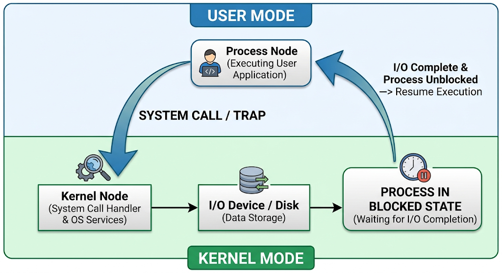
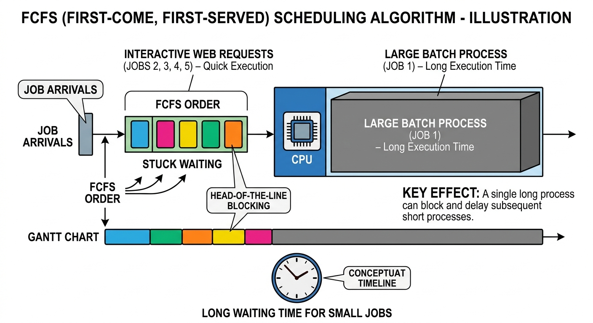
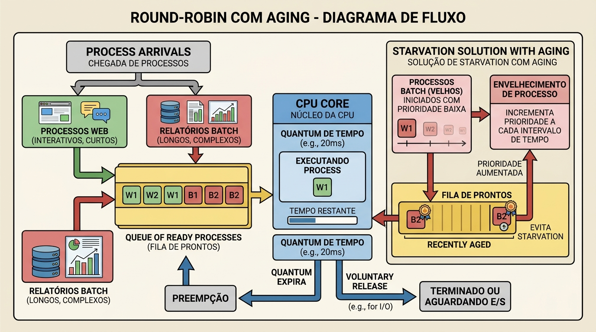

# Parte A: Entendendo a barreira do sistema

O processo vai solicitar a leitura dos dados por meio de uma chamada de sistema. Como as aplicações executam em um espaço protegido e não têm permissão para acessar o hardaware diretamente, eles precisam pedir formalmente que o sistema operacional realize a operação de leitura no disco seu nome.

No momento que a chamada de sistema é invocada, ocorre um mecanismo detalhado:

. Modo Usuário: O processo "Geração de relatórios" vai rodar inicialmente nesse modo, onde possue alguns privilegio limitados e a interação do hardware é bloqueada

. Troca de modo: após a execução da chamada de sistema, o processo vai interromper o software(chamada de trap).

. Modo Kernel: Nesse modo, o código do sistema operacional assume o controle, valida a requisição, localiza os dadps no disco e inicia a leitura física no hardware.

. Bloqueio do Processo: O sistema operacional ira mover o processo batch do estado de execução para o estado bloqueado/espera, pois o acesso do disco é extremamente lenta

. Retorno: Assim que o sistema operacional termina de ler os dados, o processo reverte o nível de privilégio de volta para o modo usuário.

# Parte b: Diagnosticando o Escalonador

O algoritimo FCFS está causando o "congelamento" da interface porque ele processa as requisições estritamente na ordem de chegada, sem interrupções. Se um processo longo ou pesado entra na fila antes de uma requisição simples da interface web, a interface precisa esperar o processo longo terminar para ser atendida.

Como esses relatórios demoram muito tempo processando, as requisições web rápidas ficam presas na fila de espera. Assim, o servidor não consegue processar e responder o clique dele até que todo relatório anterior termine.

Um algoritmo é Não preemptivo quando o sistema operacional não interrompe uma tarefa a força que está rodando na CPU. Quando o algoritmo ganha o processador, ele mesmo irá ditar o ritmo: só sai daí se terminar ou se for bloqueado por uma operação de E/S.

Para os processos interativos, o impacto pode ser devastador em um cenário de núcleo único:

. Monopólio da CPU: Mesmo que o processo interativo precise de apenas 2 milissegundo de CPU para responder o usuário, ele é obrigado a esperar minutos para que o processo batch libere o núcleo.

. Ineficiência com I/O (disco): Em sistemas não preemptivos, enquanto o processo batch espera o disco responder, a CPU pode ficar ociosa sem poder adiantar os processos interativos que estão na fila prontos para rodar.

# Parte C: Propondo a Solução

Para resolver o problema de responsividade do CloudData, o escalonamento mais adequado é o Roud-Robin.Como a aplicação roda em um servidor de núcleo único, o Roud-Robin vai garantir que a CPU seja compartilhada de forma justa e rápida entre processos impedindo que relatórios financeiros pesados bloqueiem a interface web.

Para configurar o escalonamento no sistema, os administradores não costumam programar do zero, pois o núcleo do SO (Kernel) possui políticas nativas fortemente otimizadas. Já as configurações são feitas das seguintes formas:

. Alteração de política de tempo real:  O linux possui como SCHED_RR (Roud-Robin para tempo real) e SCHED_FIFO (similar ao FCFS). È possível associar um processo a uma dessas politicas utilizando o comando chrt (Change Real-time attributes)

. Ajuste de prioridades: Para o agregador padrão do linux, usa-se o conceito de nice. O comando nicedefine a prioridade de um processo de -20 a 19.

. Contêineres e grupos de controle: a alocação de tempo em servidores modernos é feita limitando recursos por meio de ferramentas como docker ou kubernetes. Assim, podendo definir que os processos batch usem apenas uma fração máxima dos ciclos de CPU.

#### Por que o roud-Robin?

Para o cloudData, usaremos o Roud-Robin para que os processos interativos possam realizar requisições rápidas, liberam a CPU voluntariamente antes que o quantum terminar. Já os realátorios pesados esgotarão o seu quantum e serão interrompidos constantemente. Com isso, se cria uma ilusão de paralismo, garantindo que o usuário da interface receba uma resposta imediata.

#### Starvation

. È um problema de gerência onde os processos prontos para ser executados são privadosde usar a CPU, porque outros processos com maior prioridade ou menor tempo estão passando á sua frente na fila.

. Para solucionar o Starvation, O SO utiliza uma técnica chamada Aging. Esse mecanismo aumenta gradualmente a prioridade dps processos que passam muito tempo esperando na fila de pronto.

# REFERENCIAS:

PROF. SANTIAGO - PROGRAMAÇÃO E CIÊNCIA. **Me Salva Sistemas Operacionais: O que é uma Chamada de Sistema?**. YouTube, 19 set. 2022. Disponível em: <https://youtu.be/T75QR4FbmyU>. Acesso em: 8 out. 2026.

PROF. SANTIAGO - PROGRAMAÇÃO E CIÊNCIA. **Me Salva Sistemas Operacionais: Motivação para Utilização de Escalonamento de Processos**. YouTube, 12 nov. 2022. Disponível em: <https://youtu.be/BUnnIzc6_As>. Acesso em: 8 out. 2026.

PROF. SANTIAGO - PROGRAMAÇÃO E CIÊNCIA. **Me Salva Sistemas Operacionais: O que é Preempção?**. YouTube, 13 nov. 2022. Disponível em: <https://youtu.be/vz_naJHFM7M>. Acesso em: 8 out. 2026.

PROF. SANTIAGO - PROGRAMAÇÃO E CIÊNCIA. **Me Salva Sistemas Operacionais**. Playlist do YouTube. Disponível em: <https://youtube.com/playlist?list=PLBw9d_OueVJTGsjk1YYrq2KpxxLhzbjS->. Acesso em: 8 out. 2026.

TANENBAUM, Andrew S.; BOS, Herbert. **Sistemas Operacionais Modernos**. 4. ed. São Paulo: Pearson, 2016. Disponível em: <https://www.kufunda.net/publicdocs/Sistemas%20Operacionais%20Modernos%20(Andrew%20S.%20Tanenbaum,%20Herbert%20Bos).pdf>. Acesso em: 8 out. 2026.

NOME DO PODCAST. **Título do Episódio do Podcast 1**. Spotify, 2026. Podcast. Disponível em: <https://open.spotify.com/episode/5WZnsuMVXcFoDhDHMqzZJF>. Acesso em: 8 out. 2026.

NOME DO PODCAST. **Título do Episódio do Podcast 2**. Spotify, 2026. Podcast. Disponível em: <https://open.spotify.com/episode/5aEbJ8PimGND6Q9Gd09Tqw>. Acesso em: 8 out. 2026.